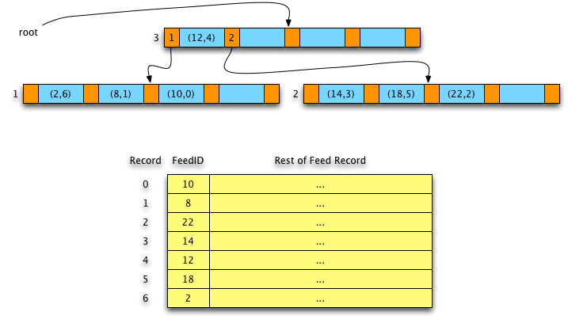
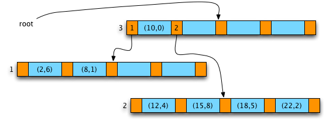
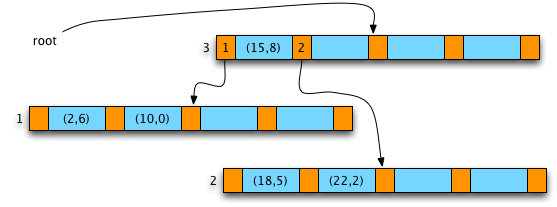

## Goals

- Database background
- B-Tree organization
- B-Tree implementation
- B-Tree operations

## Database background

### Database design


::: notes

<http://jupyter.luther.edu/~leekent/CS2Plus/chap10/chap10.html#figures-from-text>

:::

### Relational database

- Many _relations_ (entities) connected via _relationships_
- Represented as an _LDS_ or an _ERD_
- Relationships could be: _1-1_, _1-M_, _M-M_
- _M-M_ relationships must be _reified_ for the schema to work properly
- Schema should be _normalized_ to remove functional dependencies
- Reification and normalization yield new entities
- Data can be retrieved from tables using _join_ operation

### Textbook example

- Relation _Feed_ contains items like corn silage and alfalfa
  - Those items are composed of many nutrients
- Relation _FeedAttribType_ contains nutrients (calcium, iron, sugar etc)
  - Those nutrients can be part of many feeds
- Relation _FeedAttribute_ is used to reify many-many relationship between feed and nutrient
- _FeedAttribute_ adds the value for the quantity

### Textbook example LDS


### Challenge

```sql
select Feed.FeedNum, Feed.FeedName, FeedArribType.Name, FeedAttribute.Value
from Feed, FeedAttribute, FeedAttribType
where Feed.FeedID = FeedAttribute.FeedID and FeedAttribute.FeetAttribTypeID = FeetAttribType.FeetAttribTypeID
```

### Database organization

- Each relation (table) is stored as a separate file
- Joining tables means reading 2 files
  - In the worst case, sequentially
- Data can be stored in increasing order (of the key)
  - Parts of a file can be accessed directly using Python's `seek` function
- Big question: **are tables always ordered?**

::: notes

<http://jupyter.luther.edu/~leekent/CS2Plus/chap10/chap10.html#the-inefficient-join-program>

:::

### Database index

- A structure that allows efficient lookup time on any record in the table
- Implementation details are left up to a specific DBMS

### B-Tree history

- Invented by Rudolf Bayer and Edward McCreight
- Bayer also invented _red-black tree_ in 1972
- The meaning of **B** is unknown (could be Boeing, balanced, Bayer)

::: notes

"The more you think about what the B in B-trees means, the better you understand B-trees."

--McCreight

:::

## B-Tree organization

### Properties

- Balanced tree that consists of nodes
  - Each node is a combination of pointers and items
  - All _leaf_ nodes are at the same level
- The _degree_ of a tree is the minimum number of items that a node can contain
  - except the root
- The _capacity_ is the maximum number of items that a node can contain
  - $capacity = 2 \times degree$

### Properties. Continued

- Items in a node are stored in order (increasing or decreasing) of their _keys_
  - First value in the tuple
  - The second value is the record id (offset within a file)
- A pointer to the **left** of an _item_ points to a node with smaller items
- A pointer to the **right** of an _item_ points to a node with larger items

### B-Tree example



### B-Tree advantages

- Multiple indices can be built on a single table
- $O(\log_d{n})$ lookup, where $d$ is the degree of the tree and $n$ is the number of items
- Ordered **sequential** access to the index, as opposed to hashing
- Suitable to store **very large** amounts of data
- As a tree gets wider, access time improves
- Index itself can be a file
- Record can be removed from the tree (index) without rewriting the file (table)
- Tree (index) does not have to be rebuilt

## B-Tree implementation

See _btree.py_ in the _src/notes/btree/_

## B-Tree operations

- Lookup is similar to other search trees
- Insertion can cause splitting
- Removal may cause rebalancing

## B-Tree Insert

- Find a **leaf node** where the new item belongs
- If there is room in that node, insert an item
- If the node has reached its capacity, split at median item
  - Promote median item to the parent (recursively)
  - All smaller items become left node
  - All greater items become right node

### B-Tree Insert. Tree to build

- Let's built the tree of degree **2**
  - Number of items in each node is **2..4**
- Insert the following items: 10, 8, 22, 14, 12, 18, 2, 50, 15


### B-Tree Insert. Step 1: insert 10, 8, 22, 14


### B-Tree Insert. Step 2: insert 12


### B-Tree Insert. Step 3: insert 18, 2, 50


### B-Tree Insert. Step 4: insert 15


## B-Tree Delete

- Find the **item** and its **node**
- If the node is a leaf and has more than _degree_ items, delete
  - If fewer than _degree_ items, rebalance
- If the node is not a leaf, take the smallest item from the right subtree
  - Or the largest item from the left subtree
  - If this causes some node to have fewer than _degree_ items, rebalance

### B-Tree Rebalancing

- If either left or right **sibling** has extra items
  - Borrow from that sibling
  - Rotate items as necessary (left or right)
- If there is no immediate sibling to borrow from
  - Merge the node, its sibling, and the separating parent item into a new node

### B-Tree Delete. Initial tree


### B-Tree Delete. Step 1: Delete 14


### B-Tree Delete. Step 2: Delete 50



### B-Tree Delete. Step 3: Delete 8


### B-Tree Delete. Step 4: Delete 12



### B-Tree Delete. Step 5: Delete 18


## Summary

- Database background
- B-Tree organization
- B-Tree implementation
- B-Tree operations

## Thank you

Got questions?

## References

- [Data Structures and Algorithms with Python by Kent Lee and Steve Hubbard](https://dl.acm.org/citation.cfm?id=2732680)
- [B-tree - Wikipedia](https://en.wikipedia.org/wiki/B-tree)
- [Organization and maintenance of large ordered indexes | SpringerLink](https://link.springer.com/article/10.1007%2FBF00288683)
