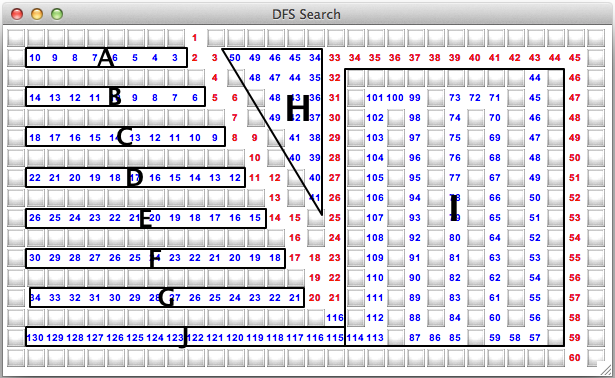
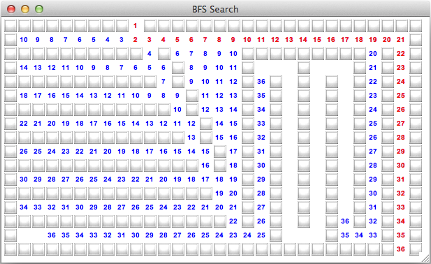
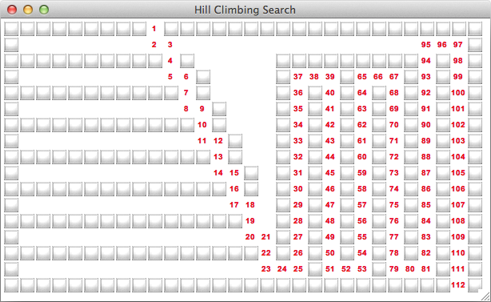
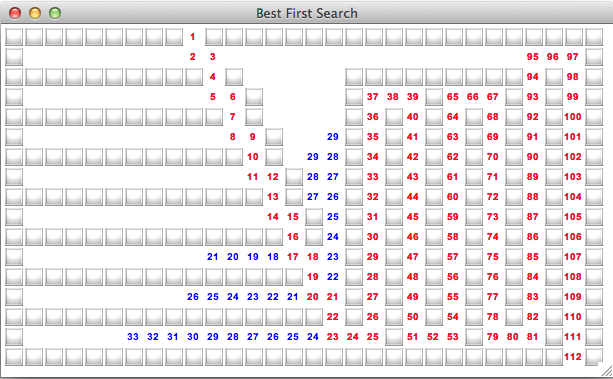
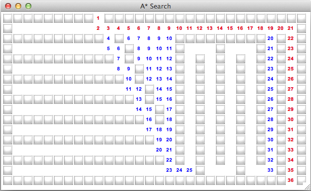

## Goals

- Depth First Search
- Breadth First Search
- Hill Climbing
- Best First Search
- A\* Search

## Problem

- Sometimes the _exact_ answer to a question (e.g. search query) is hard to compute
  - $O(n!)$ time complexity
- A _close enough_ answer may be preferred
- A _heuristic_ helps
  - eliminate possible solutions (branches of the decision tree)
  - prioritize _better_ solutions

### Maze search


### Maze implementation

```python
import namedtuple

Location = namedtuple("Location", ["row", "col"])
```

- Maze is just a graph
- Special representation: `set` of tuples
  - each `tuple` is a (row, column) pair

### Adjacent locations

```python
def adjacent(location):
    return [
        Location(location.row - 1, location.col),
        Location(location.row + 1, location.col),
        Location(location.row, location.col - 1),
        Location(location.row, location.col + 1)
        ]
```

## Depth First Search

- NSWE
- Backtracking
- Stack

### Depth First Search. Example


### Depth First Search. Example solved



## Breadth First Search

- NSWE
- Circles
- Queue

### Breadth First Search. Example


### Breadth First Search. Example solved



## Hill Climbing

- SENW
- Manhattan distance heuristic
- Under-estimate

### Hill Climbing. Example


### Hill Climbing. Example solved



### Hill Climbing. Properties

- DFS with priority
- A priori knowledge of the goal
- Under-estimate or measure the distance exactly
  - Over-estimation leads to DFS
- Can handle large search spaces and branching
- May not find an optimal solution
  - May suffer from local maxima or peaks

## Best First Search

- Combination of BFS and Hill climbing
- DFS when moving towards goal
- BFS when moving away from the goal
- Priority queue

### Best First Search. Example


### Best First Search. Example solved



## A\* Search

- Abandon long paths quickly
- Path length and distance to the goal as heuristics

### A\* Search. Example


### A\* Search. Example solved



## Comparison

| Algorithm     | Inf space | Optimal  | Data struct | Heuristic      | Comment                       |
| ------------- | --------- | -------- | ----------- | -------------- | ----------------------------- |
| Depth first   | Poor      | Possible | Stack       | None           | May get lost in an open world |
| Breadth first | Good      | Always   | Queue       | None           | Depends on branching factor   |
| Hill climbing | Good      | Possible | Stack       | Under-estimate | Local max vs global           |
| Best First    | Good      | Possible | Heap        | Under-estimate | Better than hill climbing     |
| A\*           | Good      | Depends  | Heap        | Path length    | Good enough in many cases     |

## Summary

- Depth First Search
- Breadth First Search
- Hill Climbing
- Best First Search
- A\* Search

## Thank you

Got questions?

## References

- [Data Structures and Algorithms with Python by Kent Lee and Steve Hubbard](https://dl.acm.org/citation.cfm?id=2732680)
